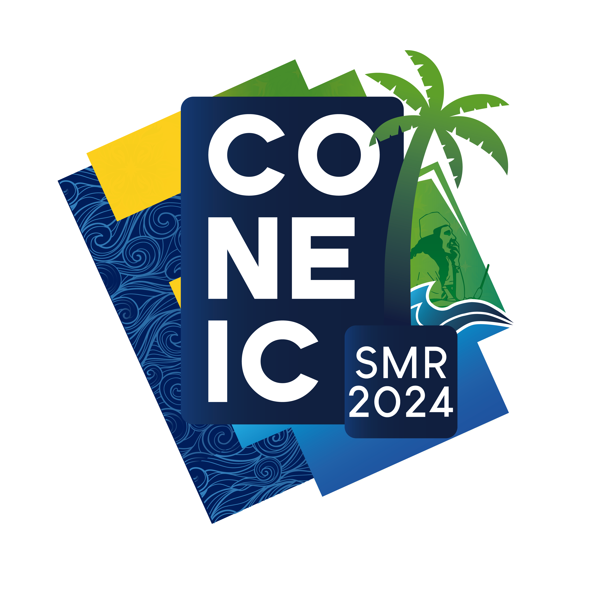

        
        <h1>
            ¡Hola! Soy Jesús Calderón
        </h1>
    

    

        

            
            

            <h2>Contacto</h2>
            

            <ul>
                <li>✉️ <b>jesusmcalderonv2002@gmail.com</b></li>
                <li>📞 <b>+57 3002456517</b></li>
                <li>📍 <b>Santa Marta, Colombia</b></li>
            </ul>
            

            <h2>Intereses</h2>
            

            <ul>
                <li>🎮 <b>Gaming</b></li>
                <li>🥾 <b>Senderismo</b></li>
                <li>🚴🏼 <b>Ciclismo</b></li>
            </ul>
            

            <h2>Idiomas</h2>
            

            <ul>
                <li>🇪🇸 <b>Español</b></li>
                <li>🇺🇸 <b>Inglés</b></li>
            </ul>
        

        

            

                Soy estudiante de Ingeniería de sistema en la Universidad del Magdalena, con experiencia de dos años y
                medio en desarrollo con tecnologías como <b>Python</b>, <b>Js</b>, <b>HTML5</b>, <b>CSS3</b>,
                <b>Bootstrap</b>, <b>Tailwind CSS</b>, etc.
                Con habilidades en el diseño de patrones, lógicas de negocios, construcción de <b>API’s</b>, además de
                experiencia en uso de distintas librerías de Python, para diferentes áreas, como, <b>Pandas</b>,
                <b>Sqlalchemy</b>,
                <b>Flask</b>, <b>OpenPyxl</b>, <b>Reportlab</b>, entre otros.
            

            

                <h2>Experiencia laboral</h2>
                

                    
                    

                        Desarrollé e implementé, tanto backend como frontend para dicha aplicación, contando con un
                        panel de administración para control de actividades y del evento prinicipal. Además de un
                        apartado de usuarios, para registrarse en las diferentes actividades. Un sistema de scaneo y
                        creación de códigos QR’s para la identificación de usuarios, sistema de notificaciones vía
                        correo electrónico y autenticación con JWT.
                          
                        <a href="https://www.coneic.org">CONEIC</a>
                    

                

            

            

                <h2>Educación</h2>
                

                    
                    

                        Llevo actualmente mis estudios en la Universidad del Magdalena, cursando el 8vo semestre,
                        adquiriendo manejo de paradigmas de la programación como POO, estructuras de datos, complejidad
                        algoritmica, bases de datos, desarrollo web, etc. Además de habilidades como redacción e
                        interpretación de historias de usuarios, requerimientos, comunicación acertiva y demás.
                    

                

            

        

    

    <h2 class="title">Habilidades</h2>
    

        

            

                <svg xmlns="http://www.w3.org/2000/svg" class="icon"
                    viewBox="0 0 448 512"><!--!Font Awesome Free 6.6.0 by @fontawesome - https://fontawesome.com License - https://fontawesome.com/license/free Copyright 2024 Fonticons, Inc.-->
                    <path
                        d="M439.8 200.5c-7.7-30.9-22.3-54.2-53.4-54.2h-40.1v47.4c0 36.8-31.2 67.8-66.8 67.8H172.7c-29.2 0-53.4 25-53.4 54.3v101.8c0 29 25.2 46 53.4 54.3 33.8 9.9 66.3 11.7 106.8 0 26.9-7.8 53.4-23.5 53.4-54.3v-40.7H226.2v-13.6h160.2c31.1 0 42.6-21.7 53.4-54.2 11.2-33.5 10.7-65.7 0-108.6zM286.2 404c11.1 0 20.1 9.1 20.1 20.3 0 11.3-9 20.4-20.1 20.4-11 0-20.1-9.2-20.1-20.4 .1-11.3 9.1-20.3 20.1-20.3zM167.8 248.1h106.8c29.7 0 53.4-24.5 53.4-54.3V91.9c0-29-24.4-50.7-53.4-55.6-35.8-5.9-74.7-5.6-106.8 .1-45.2 8-53.4 24.7-53.4 55.6v40.7h106.9v13.6h-147c-31.1 0-58.3 18.7-66.8 54.2-9.8 40.7-10.2 66.1 0 108.6 7.6 31.6 25.7 54.2 56.8 54.2H101v-48.8c0-35.3 30.5-66.4 66.8-66.4zm-6.7-142.6c-11.1 0-20.1-9.1-20.1-20.3 .1-11.3 9-20.4 20.1-20.4 11 0 20.1 9.2 20.1 20.4s-9 20.3-20.1 20.3z" />
                </svg>
                
Python

            

            

                Lenguaje de programación
            

            <h3 class="progress">
                90%
            </h3>
        

        

            

                <svg xmlns="http://www.w3.org/2000/svg" class="icon"
                    viewBox="0 0 640 512"><!--!Font Awesome Free 6.6.0 by @fontawesome - https://fontawesome.com License - https://fontawesome.com/license/free Copyright 2024 Fonticons, Inc.-->
                    <path
                        d="M392.8 1.2c-17-4.9-34.7 5-39.6 22l-128 448c-4.9 17 5 34.7 22 39.6s34.7-5 39.6-22l128-448c4.9-17-5-34.7-22-39.6zm80.6 120.1c-12.5 12.5-12.5 32.8 0 45.3L562.7 256l-89.4 89.4c-12.5 12.5-12.5 32.8 0 45.3s32.8 12.5 45.3 0l112-112c12.5-12.5 12.5-32.8 0-45.3l-112-112c-12.5-12.5-32.8-12.5-45.3 0zm-306.7 0c-12.5-12.5-32.8-12.5-45.3 0l-112 112c-12.5 12.5-12.5 32.8 0 45.3l112 112c12.5 12.5 32.8 12.5 45.3 0s12.5-32.8 0-45.3L77.3 256l89.4-89.4c12.5-12.5 12.5-32.8 0-45.3z" />
                </svg>
                
Flask

            

            

                Framework Backend
            

            <h3 class="progress">
                70%
            </h3>
        

        

            

                <svg xmlns="http://www.w3.org/2000/svg" class="icon"
                    viewBox="0 0 384 512"><!--!Font Awesome Free 6.6.0 by @fontawesome - https://fontawesome.com License - https://fontawesome.com/license/free Copyright 2024 Fonticons, Inc.-->
                    <path
                        d="M14 95.8C14 42.9 56.9 0 109.8 0H274.2C327.1 0 370 42.9 370 95.8C370 129.3 352.8 158.8 326.7 175.9C352.8 193 370 222.5 370 256C370 308.9 327.1 351.8 274.2 351.8H272.1C247.3 351.8 224.7 342.4 207.7 326.9V415.2C207.7 468.8 163.7 512 110.3 512C57.5 512 14 469.2 14 416.2C14 382.7 31.2 353.2 57.2 336.1C31.2 319 14 289.5 14 256C14 222.5 31.2 193 57.2 175.9C31.2 158.8 14 129.3 14 95.8zM176.3 191.6H109.8C74.2 191.6 45.4 220.4 45.4 256C45.4 291.4 74 320.2 109.4 320.4C109.5 320.4 109.7 320.4 109.8 320.4H176.3V191.6zM207.7 256C207.7 291.6 236.5 320.4 272.1 320.4H274.2C309.7 320.4 338.6 291.6 338.6 256C338.6 220.4 309.7 191.6 274.2 191.6H272.1C236.5 191.6 207.7 220.4 207.7 256zM109.8 351.8C109.7 351.8 109.5 351.8 109.4 351.8C74 352 45.4 380.8 45.4 416.2C45.4 451.7 74.6 480.6 110.3 480.6C146.6 480.6 176.3 451.2 176.3 415.2V351.8H109.8zM109.8 31.4C74.2 31.4 45.4 60.2 45.4 95.8C45.4 131.4 74.2 160.2 109.8 160.2H176.3V31.4H109.8zM207.7 160.2H274.2C309.7 160.2 338.6 131.4 338.6 95.8C338.6 60.2 309.7 31.4 274.2 31.4H207.7V160.2z" />
                </svg>
                
Figma

            

            

                Diseño
            

            <h3 class="progress">
                50%
            </h3>
        

        

            

                <svg xmlns="http://www.w3.org/2000/svg"
                    viewBox="0 0 448 512"><!--!Font Awesome Free 6.6.0 by @fontawesome - https://fontawesome.com License - https://fontawesome.com/license/free Copyright 2024 Fonticons, Inc.-->
                    <path
                        d="M448 96c0-35.3-28.7-64-64-64H64C28.7 32 0 60.7 0 96V416c0 35.3 28.7 64 64 64H384c35.3 0 64-28.7 64-64V96zM180.9 444.9c-33.7 0-53.2-17.4-63.2-38.5L152 385.7c6.6 11.7 12.6 21.6 27.1 21.6c13.8 0 22.6-5.4 22.6-26.5V237.7h42.1V381.4c0 43.6-25.6 63.5-62.9 63.5zm85.8-43L301 382.1c9 14.7 20.8 25.6 41.5 25.6c17.4 0 28.6-8.7 28.6-20.8c0-14.4-11.4-19.5-30.7-28l-10.5-4.5c-30.4-12.9-50.5-29.2-50.5-63.5c0-31.6 24.1-55.6 61.6-55.6c26.8 0 46 9.3 59.8 33.7L368 290c-7.2-12.9-15-18-27.1-18c-12.3 0-20.1 7.8-20.1 18c0 12.6 7.8 17.7 25.9 25.6l10.5 4.5c35.8 15.3 55.9 31 55.9 66.2c0 37.8-29.8 58.6-69.7 58.6c-39.1 0-64.4-18.6-76.7-43z" />
                </svg>
                
CSS3+JS+HTML5

            

            

                Frontend
            

            <h3 class="progress">
                85%
            </h3>
        

        

            

                <svg xmlns="http://www.w3.org/2000/svg"
                    viewBox="0 0 640 512"><!--!Font Awesome Free 6.6.0 by @fontawesome - https://fontawesome.com License - https://fontawesome.com/license/free Copyright 2024 Fonticons, Inc.-->
                    <path
                        d="M0 336c0 79.5 64.5 144 144 144l368 0c70.7 0 128-57.3 128-128c0-61.9-44-113.6-102.4-125.4c4.1-10.7 6.4-22.4 6.4-34.6c0-53-43-96-96-96c-19.7 0-38.1 6-53.3 16.2C367 64.2 315.3 32 256 32C167.6 32 96 103.6 96 192c0 2.7 .1 5.4 .2 8.1C40.2 219.8 0 273.2 0 336z" />
                </svg>
                
API REST

            

            

                Backend
            

            <h3 class="progress">
                80%
            </h3>
        

        

            

                <svg xmlns="http://www.w3.org/2000/svg"
                    viewBox="0 0 576 512"><!--!Font Awesome Free 6.6.0 by @fontawesome - https://fontawesome.com License - https://fontawesome.com/license/free Copyright 2024 Fonticons, Inc.-->
                    <path
                        d="M333.5 201.4c0-22.1-15.6-34.3-43-34.3h-50.4v71.2h42.5C315.4 238.2 333.5 225 333.5 201.4zM517 188.6c-9.5-30.9-10.9-68.8-9.8-98.1c1.1-30.5-22.7-58.5-54.7-58.5H123.7c-32.1 0-55.8 28.1-54.7 58.5c1 29.3-.3 67.2-9.8 98.1c-9.6 31-25.7 50.6-52.2 53.1v28.5c26.4 2.5 42.6 22.1 52.2 53.1c9.5 30.9 10.9 68.8 9.8 98.1c-1.1 30.5 22.7 58.5 54.7 58.5h328.7c32.1 0 55.8-28.1 54.7-58.5c-1-29.3 .3-67.2 9.8-98.1c9.6-31 25.7-50.6 52.1-53.1v-28.5C542.7 239.2 526.5 219.6 517 188.6zM300.2 375.1h-97.9V136.8h97.4c43.3 0 71.7 23.4 71.7 59.4c0 25.3-19.1 47.9-43.5 51.8v1.3c33.2 3.6 55.5 26.6 55.5 58.3C383.4 349.7 352.1 375.1 300.2 375.1zM290.2 266.4h-50.1v78.4h52.3c34.2 0 52.3-13.7 52.3-39.5C344.7 279.6 326.1 266.4 290.2 266.4z" />
                </svg>
                
Bootstrap

            

            

                Framework CSS
            

            <h3 class="progress">
                60%
            </h3>
        

        

            

                <svg xmlns="http://www.w3.org/2000/svg"
                    viewBox="0 0 448 512"><!--!Font Awesome Free 6.6.0 by @fontawesome - https://fontawesome.com License - https://fontawesome.com/license/free Copyright 2024 Fonticons, Inc.-->
                    <path
                        d="M448 80l0 48c0 44.2-100.3 80-224 80S0 172.2 0 128L0 80C0 35.8 100.3 0 224 0S448 35.8 448 80zM393.2 214.7c20.8-7.4 39.9-16.9 54.8-28.6L448 288c0 44.2-100.3 80-224 80S0 332.2 0 288L0 186.1c14.9 11.8 34 21.2 54.8 28.6C99.7 230.7 159.5 240 224 240s124.3-9.3 169.2-25.3zM0 346.1c14.9 11.8 34 21.2 54.8 28.6C99.7 390.7 159.5 400 224 400s124.3-9.3 169.2-25.3c20.8-7.4 39.9-16.9 54.8-28.6l0 85.9c0 44.2-100.3 80-224 80S0 476.2 0 432l0-85.9z" />
                </svg>
                
SQL

            

            

                Lenguaje de programación
            

            <h3 class="progress">
                70%
            </h3>
        

        

            

                <svg xmlns="http://www.w3.org/2000/svg"
                    viewBox="0 0 448 512"><!--!Font Awesome Free 6.6.0 by @fontawesome - https://fontawesome.com License - https://fontawesome.com/license/free Copyright 2024 Fonticons, Inc.-->
                    <path
                        d="M96 0C43 0 0 43 0 96L0 416c0 53 43 96 96 96l288 0 32 0c17.7 0 32-14.3 32-32s-14.3-32-32-32l0-64c17.7 0 32-14.3 32-32l0-320c0-17.7-14.3-32-32-32L384 0 96 0zm0 384l256 0 0 64L96 448c-17.7 0-32-14.3-32-32s14.3-32 32-32zm32-240c0-8.8 7.2-16 16-16l192 0c8.8 0 16 7.2 16 16s-7.2 16-16 16l-192 0c-8.8 0-16-7.2-16-16zm16 48l192 0c8.8 0 16 7.2 16 16s-7.2 16-16 16l-192 0c-8.8 0-16-7.2-16-16s7.2-16 16-16z" />
                </svg>
                
Notion

            

            

                Gestión de proyectos
            

            <h3 class="progress">
                60%
            </h3>
        

        

            

                <svg xmlns="http://www.w3.org/2000/svg"
                    viewBox="0 0 448 512"><!--!Font Awesome Free 6.6.0 by @fontawesome - https://fontawesome.com License - https://fontawesome.com/license/free Copyright 2024 Fonticons, Inc.-->
                    <path
                        d="M0 255.8C.1 132.2 100.3 32 224 32C347.7 32 448 132.3 448 256C448 379.7 347.8 479.9 224.1 480H50.9C22.8 480 .1 457.3 0 429.2H0V255.8H0zM342.6 192.7C342.6 153 307 124.2 269.4 124.2C234.5 124.2 203.6 150.5 199.3 184.1C199.1 187.9 198.9 189.1 198.9 192.6C198.8 213.7 198.9 235.4 198.1 257C199 283.1 199.1 309.1 198.1 333.6C198.1 360.7 178.7 379.1 153.4 379.1C128.1 379.1 107.6 358.9 107.6 333.6C108.1 305.9 130.2 288.3 156.1 287.5H156.3L182.6 287.3V250L156.3 250.2C109.2 249.8 71.7 286.7 70.4 333.6C70.4 379.2 107.9 416.5 153.4 416.5C196.4 416.5 232.1 382.9 236 340.9L236.2 287.4L268.8 287.1C294.1 287.3 293.8 249.3 268.6 249.8L236.2 250.1C236.2 243.7 236.3 237.3 236.3 230.9C236.4 218.2 236.4 205.5 236.2 192.7C236.3 176.2 252 161.5 269.4 161.5C286.9 161.5 305.3 170.2 305.3 192.7C305.3 195.9 305.2 197.8 305 199C303.1 209.5 310.2 219.4 320.7 220.9C331.3 222.4 340.9 214.8 341.9 204.3C342.5 200.1 342.6 196.4 342.6 192.7H342.6z" />
                </svg>
                
Linux

            

            

                Sistema operativo
            

            <h3 class="progress">
                55%
            </h3>
        

    

    <h2 class="title">Sobre mi</h2>
    

        

            Soy estudiante de Ing. en Sistema en la Universidad del Magdalena, me desempeño en el área de desarrollo
            Backend, aunque también tengo conocimientos sólidos en la parte del Frontend.
              
            Actualmente uso como lenguaje base Python🐍, principalmente usando el framework Flask, cuento con más de un
            año de experiencia laboral y dos años de experiencia demostrable, en mi tiempo de trabajo, he desarrollado
            servicios web con diferentes herramientas, tales como, JWT🔐, Sessions👨‍💻, entornos virtuales🧑‍💻, manejo
            de archivos en la nube, ORM, POO, arquitectura y estructura de datos y manejo de puertos. Manejo de archivos
            como excel en sus extensiones .xls y .xlsx, para migración a base de datos y generando los mismos desde los
            sistemas, para ser descargados, además de generar reportes en pdf con la librería reportlab.
              
            En el apartado de frontend tengo conocimientos sólidos en JS vanilla, HTML5, CSS y Bootstrap, con
            experiencia en el consumo de API's, manejo de fecth y json para conexiones con el backend, además de diseños
            prácticos con el uso del framework Bootstrap para hacerlo responsive.
              
            En otros apartados también he trabajado en la creación de scripts y bots, para hacer integraciones con
            sistemas mediante API's o conexiones directas a bases de datos, automatización de tareas y optimización de
            procesos a la hora de creación de algoritmos, obtener datos o crearlos. Llevando de la mano proyecttos en
            conjunto, cumpliendo el rol de QA en ocaciones requeridas, teniendo experiencia en la parte de dirección y
            coordinación de procesos de concepción y diseño de softare para implementación de sistemas en entorno de
            desarrollo y admás de un entorno de producción.
        

    

